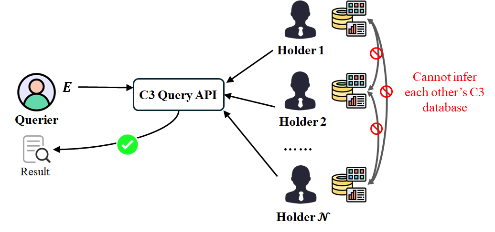
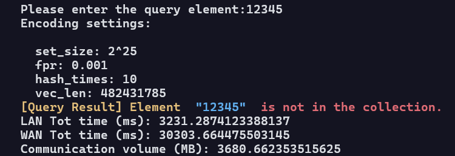
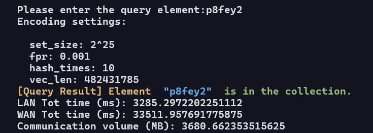
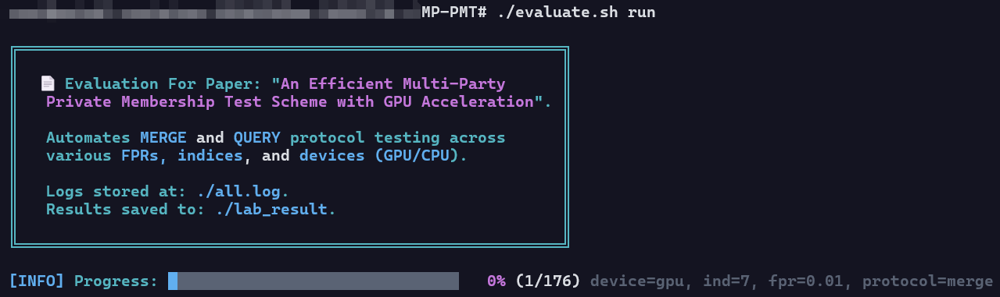
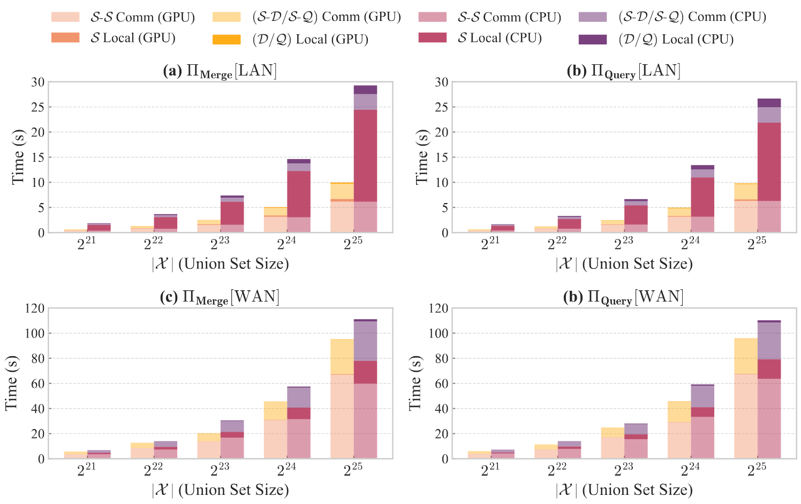

# Multi-Party Private Membership Test (MPMT)
## Latest Version — Work in Progress - Day3
 


## Overview

This repository implements the scheme presented in the paper ***An Efficient Multi-Party Private Membership Test Scheme with GPU Acceleration*.** It provides a backend written in C++, fully implementing all the schemes described in the paper. Additionally, this repository includes scripts to run all experiments and generate figures with a single command, making it easy to reproduce the results from the paper.

In recent years, the issue of **Compromise Credential Checking (C3)** has become increasingly prevalent. This project is designed around a multi-party C3 scenario, where multiple data holders independently maintain datasets containing weak credentials. The goal is to provide a privacy-preserving Credential Leakage Verification service. Users need to know whether their credentials have been leaked, but they should not learn about the data held by any individual data holder. Similarly, no data holder should learn the queried credential or have access to the credential datasets of other data holders.




---

## Below is the Early Version — Tested on Ubuntu 20.04


### Environment Setup

The experimental environment for this project is as follows:

- Ubuntu 20.04
- GCC 9.4.0
- Python 3.8.10
- CUDA 11.6

**[The parameters used in the example program require more than 32GB of GPU memory. The paper uses two 24GB NVIDIA RTX 4090 GPUs.]**

To build the project, run:

```
chmod +x build.sh
./build.sh sudo  # Use ./build.sh if you are not running as root
```

to ensure that the required CUDA and Python dependencies are installed. If there are any issues, please install the required dependencies manually.


------


### Preparation
**Modify the project root path**
The default root directory is `/root/MP-PMT`. It needs to be changed to the actual directory. Modify the following in `./script/config.json`:
``` 
    "proj_dir":{ 
        "root_dir": "/root/MP-PMT" 
    ...
```
to:
```
    "proj_dir":{ 
        "root_dir": <actual_path>
    ...
```


**Compile the CUDA/C++ Backend**

To compile the backend, run:

```
make -j16
```

If you want to run this scheme across multiple GPUs, please add `-D_MULTI_DEVICE_` to the `CUDA_FLAGS`.


**Set Execution Permissions**

Make sure to grant execution permissions to the following scripts:

```
chmod +x clean_as.sh
chmod +x draw.sh
chmod +x evaluate.sh
```


**Prepare Credential Datasets in the `./demo_dataset` Directory**

You can specify the number of data holders and their respective credential sets. For example, if there are 1024 data holders, the `./demo_dataset` folder will contain files like `holder_1.csv`, `holder_2.csv`, ..., `holder_1024.csv`, where `holder_1.csv` contains the leaked credentials held by the first data holder.

By default, a `holder_1.csv` file is provided, which can be used to run the Merge, Query, and experimental evaluation scripts. If needed, you can run `./demo_dataset/demo_gen.py` to generate credential datasets of a specified size and number of data holders, or you can organize your own datasets.


------


### Running the Protocols

**Run the Merge Protocol**

To simulate a three-party Merge operation on your local machine, run the following commands for each process:

For the i-th Data Holder:

```
./run_merge.sh DH i [gpu|cpu]
```

For the agent server:

```
./run_merge.sh [AS0|AS1] [gpu|cpu]
```

By default, the storage path for the two agent servers is set to `./agent_storage`, where the encoded shares of the agent servers will be stored. In a real network environment, you can modify the storage paths and IP addresses accordingly for cross-device deployment.

To reset the agent server storage and start over, run:

```
./clean_as.sh
```


**Run the Query Protocol**

To simulate the Query operation from a querier’s perspective, run the following commands for each process:

Before running the Query protocol, ensure that the Merge operation has been executed so that the agent servers hold the encoded shares of the Union Set.

For the Querier:

```
./run_query.sh QE [gpu|cpu]
```

For the agent servers:

```
./run_query.sh [AS0|AS1] [gpu|cpu]
```

On the Querier side, input the element you wish to query to check if it exists in the Union Set.

**[Demo]**

Query a non-existent element `12345`.



Query an existing element `p8fey2` (in the example's holder_1.csv).




------


### Evaluation & Figure Generation

To run all the experiments and collect the data as presented in the paper, execute:

```
./evaluate.sh run
```

After collecting the experimental data, you can generate the figures (*Fig. 4* - *Fig. 7*) from the paper by running:

```
./draw.sh run
```

To clean up the experimental data and generated figures, run:

```sh
./evaluate.sh clean
./draw.sh clean
```

Run the example



To simulate network transmission delays, the provided experimental scripts use the actual network data from the original paper's experiments. As shown in the figure below, it provides a detailed analysis of the overhead of the core protocol in the paper's scheme.


